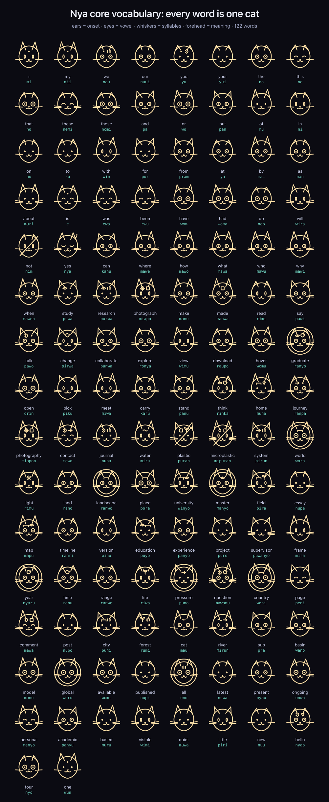
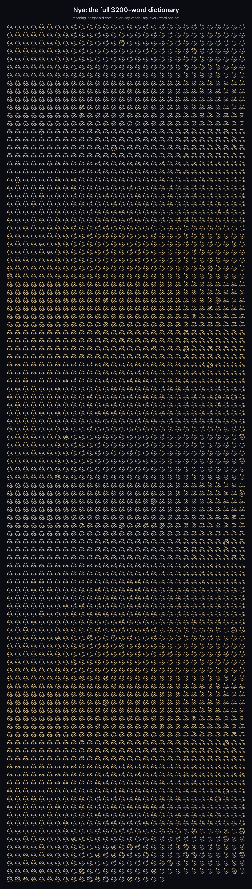

# Nya · 猫猫语

A small **constructed cat language**: an invented lexicon, a light regular
grammar, and one unified writing system where **every word is a single cat**.
Each cat's anatomy encodes the word, sound and meaning together. Type English,
get Nya, render it as rows of cats.

Built as the playful "猫猫语" mode for [syydaniel.github.io](https://syydaniel.github.io),
extracted here as a standalone language system.



**[Open the translator station](demo/translate.html)**: a fancy, self-contained
page that translates English to Nya (and back), renders each word as a cat-sigil,
breaks every word down, reads it aloud, and includes the full dictionary and a
"learn the cats" guide.

```
Hello! I study water and plastic.
->  Nyao! Mi puwa miru pa puran nya.
```

## Phonology

- Consonants: `m n p r w y`, plus the clusters `ny mr pr`.
- Vowels: `a i u e o`.
- Optional codas: `n r`.
- Syllables are `(C)V(n/r)`; words are one to three syllables. So everything
  sounds like a content cat: *mi, nya, purwa, miapo, ranpa, mipuran*.

## Grammar

Nya is analytic and isolating (no conjugation). The rules are few and regular:

| Feature | Rule | Example |
| --- | --- | --- |
| Indefinite article | `a` / `an` are dropped | "a cat" -> "mau" |
| Definite article | `the` -> `na` | "the world" -> "na wora" |
| Plural | suffix `-mi` on the noun | "system" `pirun` -> "systems" `pirunmi` |
| Clause mood | a purr particle `nya` before a final `.` `!` `?` | "Mi puwa miru **nya**." |
| Word order | follows the source (analytic) | subject verb object |
| Unknown words | productive phonetic derivation (deterministic) | "retention" -> "nimromon" |

The fallback is deterministic: a given English word always derives the same Nya
word, so the language is internally consistent even beyond the core lexicon.

## Lexicon

Two layers:

- **Curated core**: ~90 hand-made words (pronouns, particles, common verbs, and
  the vocabulary of the site: water, plastic, river, research, photography,
  university...). See [`nya/nya.mjs`](nya/nya.mjs).
- **Full dictionary**: **3200 words** in [`nya/lexicon.json`](nya/lexicon.json):
  the curated core plus a broad spread of everyday English vocabulary, each
  mapped to a unique, collision-free Nya word by the language's own phonetic
  derivation. Regenerate with `node nya/build-lexicon.mjs`. The website
  lazy-loads this file the first time 猫语 mode is used.

All 3200 words, each rendered as one cat (browse them interactively in the demo):



Browse the full **rendered dictionary** ([`demo/dictionary.html`](demo/dictionary.html)):
every word as a cat-sigil with its English gloss, romanized Nya, and (where it has
one) its radical composition. Searchable and alphabetised.

A few core words:

```
i mi · we nau · you yu · the na · and pa · with wim · not nim · yes nya
water miru · river mirun · plastic puran · microplastic mipuran · world wora
research purwa · study puwa · photograph miapo · journey ranpa · cat mau · hello nyao
```

## The 16 semantic radicals (the meaning layer)

Meaning is carried by 16 **radicals** (atoms of meaning). On a cat-sigil they are
the mark on the cat's **forehead**, and a word can compose more than one, so the
meaning is decipherable by logic rather than by sound.

| radical | meaning | radical | meaning |
| --- | --- | --- | --- |
| self | self / I | place | place / ground |
| water | water | life | life / plant |
| flow | flow / move | change | change / time |
| big | big / great | many | many / plural |
| small | small | speak | speak / sound |
| see | see / know | feel | heart / feel |
| light | light | being | being / cat |
| made | made / artifact | not | not / negate |

Words are compositions:

```
water = water              river = water + flow        world = big + place
see   = see                research = see + many       study = see + self
made  = made               plastic = made + not + life
university = place + see    microplastic = small + made + not + life
journey = flow + self       hello = speak + feel
```

Unknown words carry no forehead mark; their ears, eyes and whiskers still encode
the sound. See [`nya/logogram.mjs`](nya/logogram.mjs).

## The cat-alphabet (for names)

Proper nouns are not turned into sigils; they are spelled letter-by-letter in the
**NyaGlyph** cat-alphabet ([`font/build-cat-font.py`](font/build-cat-font.py),
built with fontTools), where each Latin letter, digit and punctuation mark is a
little cat: cat faces, paws, sitting / stretching / rolling cats, a paw-heart,
fish, hearts and stars. Regenerate with:

```bash
python3 font/build-cat-font.py   # -> font/nyaglyph.woff
```

## Unified script: one cat-sigil per word

Every word renders as one cat-sigil ([`nya/script.mjs`](nya/script.mjs)). The
cat's own anatomy encodes the word, sound and meaning together:

| feature | encodes |
| --- | --- |
| ears | onset (first consonant of the spoken Nya word) |
| eyes | the word's first vowel (a i u e o) |
| whiskers | syllable count (1 to 3) |
| forehead mark | meaning, drawn from the 16 semantic radicals |
| closed-eye purring cat | the clause-final particle `nya` |

So *miru* "water" is a cat with m ears, "i" eyes, two whiskers and a little wave
on its forehead. Proper nouns and names are not turned into sigils: they stay
spelled in the cat-alphabet (the NyaGlyph font), a separate register, the way
mixed scripts use a syllabary for foreign names. Hover any glyph to read its
romanized Nya. One system, used everywhere from headings to body text.

## Culture

Nya is cat-centred. Its radicals are the things that matter to a cat: *self,
beings, water, light, warmth (feel), place and territory, food and growth
(life), seeing, and change*. There is no indefinite article (a cat does not
count what it has not yet caught); plurals are a soft afterthought (`-mi`); and
every sincere utterance ends in a **purr** (`nya`). Speech radiates outward, the
way a purr fills a room.

## Usage

```js
import { translate } from 'nyalang';            // or './nya/nya.mjs'
translate('Research journey');                   // "Purwa ranpa"

import { renderCatText } from './nya/script.mjs';
renderCatText('Research journey');               // -> a row of cat-sigils (SVG)
```

## Demo

```bash
npm run demo   # python3 -m http.server 8080, then open /demo/
```

## Structure

```
nya/nya.mjs            # core lexicon + grammar + translator (spoken Nya)
nya/lexicon.json       # the full 3200-word dictionary (generated)
nya/build-lexicon.mjs  # dictionary generator (core + everyday vocabulary)
nya/logogram.mjs       # the 16 semantic radicals (forehead-mark layer)
nya/script.mjs         # the unified cat-sigil script (one cat per word)
font/build-cat-font.py # the cat-alphabet font generator (fontTools)
font/nyaglyph.woff     # the built font (used for names)
demo/index.html        # live translator: cat-sigils + radical legend
demo/dictionary.html   # the rendered, searchable dictionary (every word)
```

## License

MIT. Have fun. 🐾
